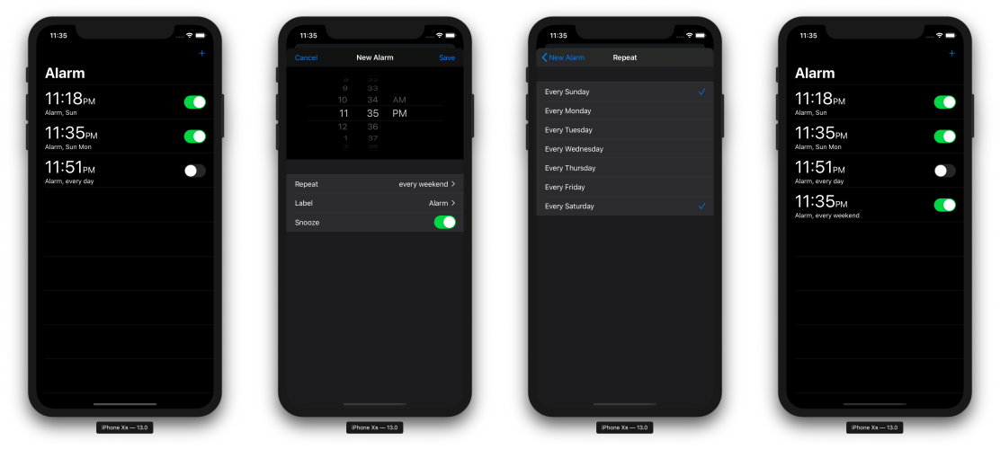

# SwiftUIAlarm

SwiftUIAlarm is an example Alarm-like application using [SwiftUI](https://developer.apple.com/xcode/swiftui/) which is first introduced in WWDC19 keynote.

## Requirements

* Xcode 11 Beta
* Swift 5.1

## To-Do

- [ ] Editing and Deleting
- [ ] Perfectly Dismiss Presented View

## License

SwiftUIAlarm is under MIT license. See the [LICENSE](LICENSE) file for more info.